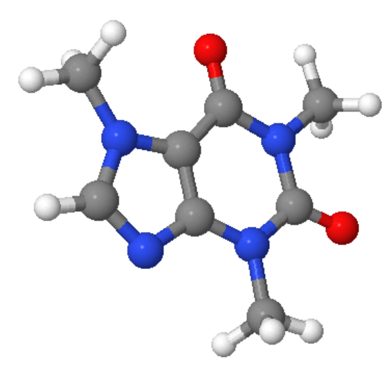

# QDK

QDK includes the Python packages for the Quantum Development Kit (QDK).

## azure.quantum

The `azure-quantum` package for Python provides functionality for interacting with Azure Quantum workspaces,
including creating jobs, listing jobs, and retrieving job results.

For details on how to get started with Azure Quantum, please visit https://azure.com/quantum.

You can also try our [Quantum Computing Fundamentals](https://aka.ms/learnqc) learning path to get familiar with the basic concepts of quantum computing, build quantum programs, and identify the kind of problems that can be solved.

### Installation and getting started

We recommend installing [Anaconda](https://www.anaconda.com/products/individual) or [Miniconda](https://docs.conda.io/en/latest/miniconda.html). 

To install the `azure-quantum` package, run

```bash
pip install azure-quantum
```

#### Development

To install the package in development mode, we recommend creating a new environment using the following command:

```bash
# Create new conda environment
conda env create -f azure-quantum/environment.yml
```

Then, the package can be installed after activating the environment:

```bash
# Activate conda environment
conda activate azurequantum

# Install package in development mode
pip install -e azure-quantum
```

## qdk.chemistry

Q# chemistry library's Python application layer, contains tools for creating 2D molecular diagrams and calculating their 3D geometry using RDKit.



### Installation and getting started

We recommend installing [Anaconda](https://www.anaconda.com/products/individual) or [Miniconda](https://docs.conda.io/en/latest/miniconda.html).

First, install RDKit:

```bash
conda install -c rdkit rdkit
```

To install the `qdk` package, run

```bash
pip install qdk
```

To get started, try out the [example notebook](../examples/chemistry/Molecule.ipynb) in the examples/chemistry folder.

#### Development

To install the package in development mode, we recommend creating a new environment using the following command:

```bash
# Create new conda environment
conda env create -f qdk/environment.yml
```

Then, the package can be installed after activating the environment:

```bash
# Activate conda environment
conda activate qdk

# Install package in development mode
pip install -e qdk
```

### How to install Jupyter-JSME in development mode

Jupyter-JSME is an optional dependency that will enable a simple Molecule editor. For more information about JSME, see: [JSME](https://jsme-editor.github.io/).

```bash
jupyter nbextension install jupyter_jsme
jupyter nbextension enable jupyter_jsme/extension
```
