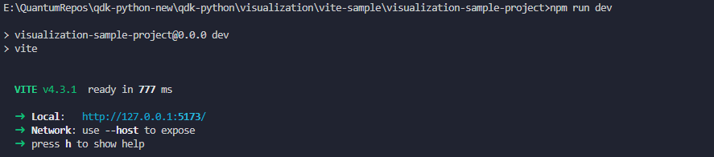

## Visualization Sample Project

### Pre-reqs
#### Notes
This sample project was created using [Vite.](https://vitejs.dev/guide/)

1. Install packages
    ```
    cd visualization\react-lib
    npm run install
    ```
    ```
    cd visualization\vite-sample\visualization-sample-project
    npm run install
    ```
2. Install vite
    `npx vite`
3) Choose whether you want to run the <b>Time Diagram</b> or <b>Space Diagram</b> by uncommenting the diagram type you wish to run in the .env file.
   
    ```
    cd visualization\vite-sample\visualization-sample-project
    vim .env

    #.env
    # VITE_DIAGRAM_TYPE=timediagram
      VITE_DIAGRAM_TYPE=spacediagram
    ```

## How to run the project

1. Run the Vite sample project.
```
cd visualization\vite-sample\visualization-sample-project
npm run dev
```
2. Go to the local url in your browser.


### Changes
Most changes can be made to the sample project or the react-lib project and simply saving will reload the sample project if it is running. 